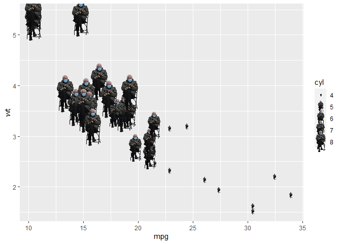

<!-- README.md is generated from README.Rmd. Please edit that file -->

# ggBernie 

<!-- badges: start -->


<!-- badges: end -->

ggBernie provides a geom to place Bernie Sanders on your plots. This is
inspired by the infamous inaugural meme of Bernie Sanders.

## Installation

You can install from
[GitHub](https://github.com/mohit2152sharma/ggBernie)

``` r
#install.package("remotes")
remotes::install_github("mohit2152sharma/ggBernie")
```

## Example

This is a basic example which shows you how to use `geom_bernie()`

``` r
library(ggplot2)
library(ggBernie)

ggplot(mtcars) + 
  geom_bernie(aes(mpg, wt, size = cyl))
```



## Acknoledgements

-   [coolbutuseless/geomlime](https://github.com/coolbutuseless/geomlime),
    from where most of the code is copied
-   Tidyverse team for maintaining and developing `ggplot2`
-   [taber](https://twitter.com/taber/status/1351938194024124419), for
    providing the transparent PNG of Bernie Sanders
